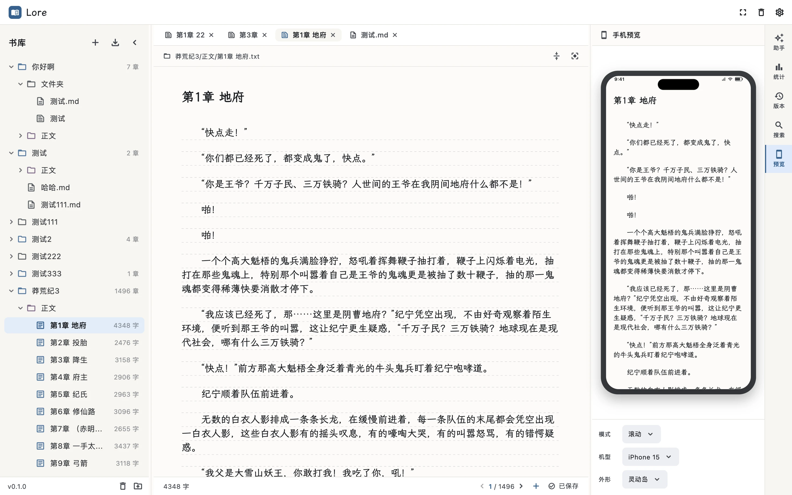
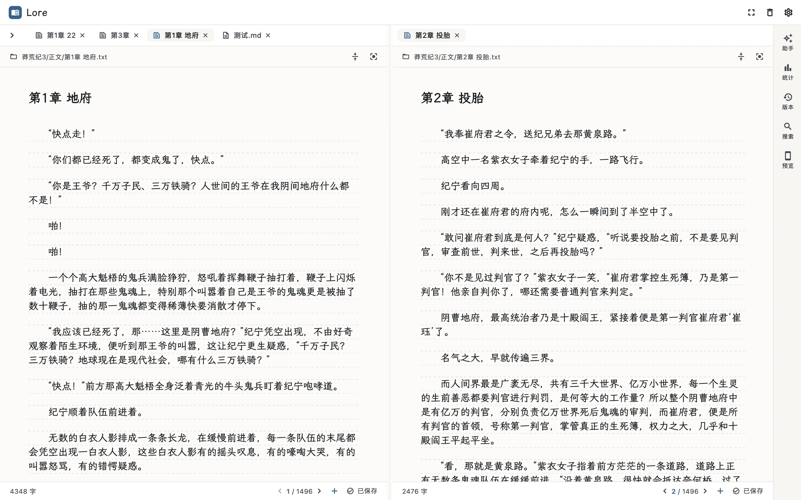
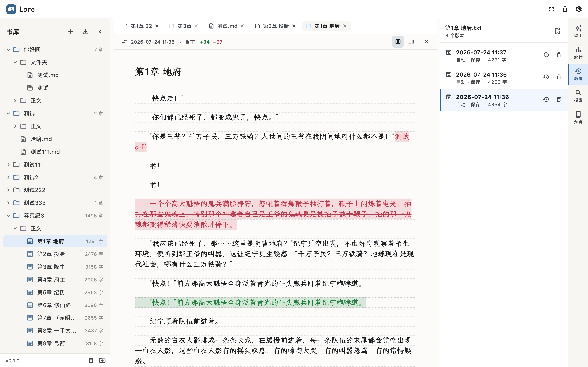
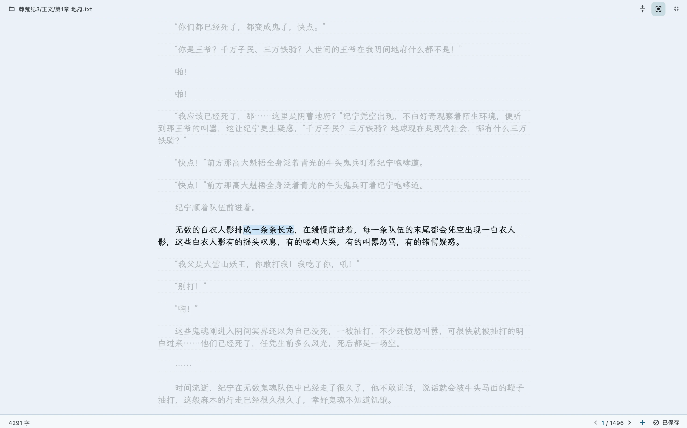

# Lore

<p align="center">
  
</p>

> 本地优先的网文写作软件 · 优先支持 macOS 与 Android

Lore 为长篇、连载网文作者而生。它把写作、阅读校验、书库管理与可控的 AI 协作放进一个安静、可长期信任的工作台——而你写下的每一个字，都以纯文本的形式留在你自己的磁盘上。

**写作是核心，阅读是校验方式，书库是长期记忆，AI 是可控的创作协作者。**

<table>
  <tr>
    <td width="50%" align="center"></td>
    <td width="50%" align="center"></td>
  </tr>
  <tr>
    <td align="center">分屏对照</td>
    <td align="center">版本对比</td>
  </tr>
  <tr>
    <td width="50%" align="center"></td>
    <td width="50%" align="center"></td>
  </tr>
  <tr>
    <td align="center">自定义背景</td>
    <td align="center">专注模式</td>
  </tr>
</table>

## 为什么是 Lore

**你的稿子，永远是你自己的**
内容以 TXT / Markdown 保存在你指定的本地文件夹里。没有云端锁定，也没有专有格式——用 Finder、VS Code、Git，甚至系统记事本都能直接打开。哪怕 Lore 不在，你的小说也完好无损；索引与缓存丢失，都能自动重建。

**为长篇连载设计**
书库 → 小说 → 卷 → 章的清晰结构，拖拽即可重排。多标签页同时打开多个章节来回切换；即便是几十万字的超长单文件，也能流畅滚动、增量计字、随时撤销。自动保存与崩溃恢复让你关掉重开，光标和未写完的那一行都还在原处。

**沉浸写作**
打字机模式让光标始终停在视线中央，专注模式隐去一切干扰。自定义背景图、字号、行高、行宽，配合素白 / 纸张 / 霜华 / 翠微 / 夜间 / 墨渊六套主题，调成只属于你的写作环境。

**随时回到任何一个版本**
自动按字数变更阈值留档历史版本，也可手动留档。逐行 diff 对比，看清楚每一处改动再决定是否恢复。删错的章节能从回收站找回——永久删除前会再向你确认一次。

**看见每天的进步**
今日净增、本周净增、连续写作天数、当月日历回顾，按本地自然日统计。设一个每日字数目标，让进度条替你记账。

**在手机上预览成书的效果**
桌面端写作，旁边实时同步一台手机的预览，支持左右翻页与上下滚动两种阅读模式——写到哪，看到哪。

**顺手的小工具**
查找替换（支持正则）、跨章节正文搜索、TXT 导入（自动探测编码）、按阅读顺序把整本或整卷合并导出。

## 现状

核心写作闭环——书库管理、编辑、自动保存、崩溃恢复、历史版本、写作统计、沉浸写作、导入导出、Android 文件访问——已全部完成并稳定可用。模板系统、全书库搜索、连续阅读模式、AI Agent 正在路上（见[路线图](docs/designs/quality-and-roadmap.md)）。

## 常见问题

**我的数据存在哪里？**
在你指定的本地文件夹里，纯文本 TXT / Markdown。Lore 只是把它们组织得更适合写作，文件本身完全属于你。

**支持 Windows / iOS / Web 吗？**
当前发布 macOS 与 Android，其他平台在规划中。

**需要联网吗？**
写作、书库、历史、统计全部本地完成，离线可用。AI 协作能力正在开发中，未来默认是可选、可控的。

**怎么用上？**
目前需从源码构建（见下方「开发者指南」）。预编译版本会在正式发布时提供。

---

## 开发者指南

> 普通用户可忽略本节以下内容。

仓库为 Flutter monorepo：

```text
apps/lore_app/             Flutter 应用（平台、providers、功能 UI）
packages/lore_domain/      领域模型与规则（无依赖）
packages/lore_application/ 用例、服务与仓储端口
packages/lore_storage/     本地文件系统持久化与恢复逻辑
packages/lore_platform_adapters/ Flutter 平台桥接与本地偏好存储
packages/lore_editor/      文本编辑、查找替换、Markdown 预览
packages/lore_ui/          主题与通用展示样式
contracts/                 预留的客户端/服务端共享契约
docs/                      产品设计、架构决策、截图
```

依赖向内流动：UI 与 storage 依赖 application 的端口和 domain 类型，domain 包保持独立。未来的服务端会加入同一 monorepo，但当前阶段保持客户端与本地存储优先。

**环境**：Flutter 3.44.x / Dart 3.12.x，macOS 与 Android 工具链。

```bash
flutter pub get
(cd apps/lore_app && flutter run -d macos)   # Android：flutter run -d android
```

**测试**：

```bash
./scripts/test.sh    # flutter analyze + 所有包测试
```

> 若 shell 设置了 `http_proxy` / `https_proxy`（如 Clash 的 `127.0.0.1:7890`），手动跑 `flutter test` 前请设 `NO_PROXY=127.0.0.1,localhost`（`./scripts/test.sh` 已内置），否则 `flutter_tester` 回环连接会报 `HttpException`。

**发布 Release**（macOS，未签名 dmg）

推送 `v*` tag 即触发 [`.github/workflows/release.yml`](.github/workflows/release.yml) 自动构建 macOS dmg（含拖拽安装）并发布 GitHub Release：

```bash
git tag v0.1.0
git push --tags
```

当前为未签名版本（ad-hoc），用户首次打开需按 Release 正文执行 `xattr -cr` 解除 Gatekeeper 拦截。完整发版流程与后续签名路线见 [docs/releases.md](docs/releases.md)。

更多设计文档见 [docs/designs/](docs/designs/)，构建与提交规范见 [AGENTS.md](AGENTS.md)。提交遵循 Conventional Commits（`feat:` / `fix:` / `docs:` / `chore:`）。

## License

[MIT](LICENSE)
